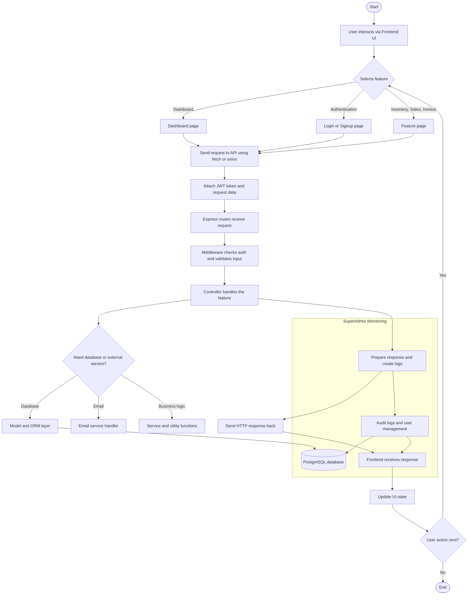

```mermaid
flowchart TB

A([Start]) --> B[User interacts via Frontend UI]
B --> C{Selects feature}

C -->|Dashboard| D[Dashboard page]
C -->|Authentication| E[Login or Signup page]
C -->|Inventory, Sales, Invoice| F[Feature page]

D --> G[Send request to API using fetch or axios]
E --> G
F --> G

G --> H[Attach JWT token and request data]
H --> I[Express routes receive request]
I --> J[Middleware checks auth and validates input]
J --> K[Controller handles the feature]

K --> L{Need database or external service?}

L -->|Database| M[Model and ORM layer]
M --> N[(PostgreSQL database)]

L -->|Email| O[Email service handler]
L -->|Business logic| P[Service and utility functions]

K --> Q[Prepare response and create logs]
Q --> R[Send HTTP response back]

R --> S[Frontend receives response]
S --> T[Update UI state]

T --> U{User action next?}
U -->|Yes| C
U -->|No| V([End])

subgraph SuperAdmin Monitoring
W[Audit logs and user management]
Q --> W
W --> N
W --> S
end
```